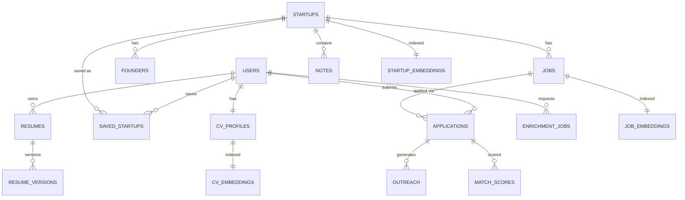

# DATABASE_SCHEMA.md

# Scout Database Schema

## Database Stack
- PostgreSQL 16
- pgvector
- Redis (cache/queues, not modeled here)
- SQLAlchemy 2.0
- Alembic

## Design Principles
- UUID primary keys (`gen_random_uuid()`)
- Soft deletes (`deleted_at`) on user-facing entities
- Audit timestamps (`created_at`, `updated_at`) on every table
- JSONB for flexible/semi-structured metadata (enrichment payloads, scraped fields)
- pgvector for semantic search (`vector(1536)` — adjust to embedding model dimension)
- Foreign keys `ON DELETE CASCADE` for owned child data, `ON DELETE SET NULL` where the parent is optional context
- No hard deletes from the API layer; a scheduled job may hard-delete soft-deleted rows past a retention window

## Core ERD



## Tables

### users
| Column | Type | Notes |
|---|---|---|
| id | uuid PK | default `gen_random_uuid()` |
| email | text | unique, not null |
| password_hash | text | Argon2 |
| full_name | text | |
| avatar_url | text | R2 key or external URL |
| role | text | `user` \| `admin`, default `user` |
| onboarding_completed_at | timestamptz | nullable |
| created_at | timestamptz | not null, default now() |
| updated_at | timestamptz | not null, default now() |
| deleted_at | timestamptz | nullable |

Indexes: unique on `email`; partial index on `deleted_at IS NULL`.

### cv_profiles
One active CV/portfolio profile per user, used as the anchor for matching.

| Column | Type | Notes |
|---|---|---|
| id | uuid PK | |
| user_id | uuid FK → users.id | cascade delete, unique (1:1) |
| raw_text | text | extracted CV text |
| structured_data | jsonb | parsed skills, roles, years of experience |
| source_file_key | text | R2 object key for uploaded CV |
| created_at / updated_at | timestamptz | |

### cv_embeddings
| Column | Type | Notes |
|---|---|---|
| id | uuid PK | |
| cv_profile_id | uuid FK → cv_profiles.id | cascade delete |
| embedding | vector(1536) | pgvector |
| model | text | e.g. `text-embedding-3-large` |
| created_at | timestamptz | |

Index: `ivfflat (embedding vector_cosine_ops)` or `hnsw` (see Indexing Strategy).

### startups
| Column | Type | Notes |
|---|---|---|
| id | uuid PK | |
| name | text | not null |
| website | text | |
| stage | text | `idea`\|`pre-seed`\|`seed`\|`series_a`\|... |
| funding_total_usd | numeric | nullable |
| last_funding_date | date | nullable |
| hiring_status | text | `unknown`\|`hiring`\|`not_hiring` |
| summary | text | AI-generated company summary |
| tags | text[] | |
| source | text | `yc`\|`wellfound`\|`producthunt`\|`manual`\|... — FK-like reference to `source_registry.source_key` (not enforced by FK since `manual`/`api` entries have no registry row) |
| source_url | text | |
| last_enriched_at | timestamptz | nullable — distinct from `updated_at`, which also bumps on user edits; drives the refresh-tiering cadence in `ARCHITECTURE.md` |
| created_by | uuid FK → users.id | who first saved it (nullable — startups can be shared/global) |
| created_at / updated_at | timestamptz | |
| deleted_at | timestamptz | nullable |

Indexes: unique on `(website)` where not null; GIN index on `tags`; btree on `stage`, `hiring_status`.

### startup_embeddings
| Column | Type | Notes |
|---|---|---|
| id | uuid PK | |
| startup_id | uuid FK → startups.id | cascade delete |
| embedding | vector(1536) | |
| model | text | |
| created_at | timestamptz | |

### founders
| Column | Type | Notes |
|---|---|---|
| id | uuid PK | |
| startup_id | uuid FK → startups.id | cascade delete |
| name | text | not null |
| title | text | e.g. CEO, CTO |
| linkedin_url | text | |
| twitter_url | text | |
| bio | text | AI-enriched |
| background_summary | jsonb | prior companies, education (structured) |
| created_at / updated_at | timestamptz | |

### jobs
| Column | Type | Notes |
|---|---|---|
| id | uuid PK | |
| startup_id | uuid FK → startups.id | cascade delete |
| title | text | not null |
| description | text | |
| location | text | |
| remote | boolean | |
| employment_type | text | `full_time`\|`intern`\|`contract` |
| seniority | text | |
| salary_min / salary_max | numeric | nullable |
| url | text | source posting URL |
| status | text | `open`\|`closed`\|`unknown` |
| created_at / updated_at | timestamptz | |
| deleted_at | timestamptz | nullable |

Index: btree on `(startup_id, status)`.

### job_embeddings
| Column | Type | Notes |
|---|---|---|
| id | uuid PK | |
| job_id | uuid FK → jobs.id | cascade delete |
| embedding | vector(1536) | |
| model | text | |
| created_at | timestamptz | |

### saved_startups
Join table representing a user's personal workspace entry for a startup (their notes/status live here, not on the shared `startups` row).

| Column | Type | Notes |
|---|---|---|
| id | uuid PK | |
| user_id | uuid FK → users.id | cascade delete |
| startup_id | uuid FK → startups.id | cascade delete |
| status | text | `saved`\|`interested`\|`archived` (application-level status lives on `applications`) |
| saved_via | text | `extension`\|`web`\|`api` |
| created_at | timestamptz | |

Index: unique `(user_id, startup_id)`.

### notes
| Column | Type | Notes |
|---|---|---|
| id | uuid PK | |
| user_id | uuid FK → users.id | cascade delete |
| startup_id | uuid FK → startups.id | cascade delete, nullable |
| founder_id | uuid FK → founders.id | cascade delete, nullable |
| body | text | |
| created_at / updated_at | timestamptz | |

### applications
| Column | Type | Notes |
|---|---|---|
| id | uuid PK | |
| user_id | uuid FK → users.id | cascade delete |
| startup_id | uuid FK → startups.id | cascade delete |
| job_id | uuid FK → jobs.id | nullable, set null on job delete |
| status | text | `saved`\|`interested`\|`applied`\|`interview`\|`offer`\|`rejected`\|`archived` |
| applied_at | timestamptz | nullable |
| resume_version_id | uuid FK → resume_versions.id | nullable, which resume was used |
| created_at / updated_at | timestamptz | |

Index: btree on `(user_id, status)`; unique `(user_id, job_id)` where `job_id is not null`.

### match_scores
Cached results of the matching pipeline so scores don't need recomputation on every dashboard load.

| Column | Type | Notes |
|---|---|---|
| id | uuid PK | |
| user_id | uuid FK → users.id | cascade delete |
| job_id | uuid FK → jobs.id | cascade delete, nullable |
| startup_id | uuid FK → startups.id | cascade delete |
| score | numeric(5,2) | 0–100 |
| explanation | jsonb | matched skills, gaps, reasoning summary |
| model | text | scoring model/version used |
| computed_at | timestamptz | |

Index: unique `(user_id, job_id)`; btree `(user_id, score desc)`.

### resumes
A logical resume "document" a user maintains (may have multiple, e.g. per role type).

| Column | Type | Notes |
|---|---|---|
| id | uuid PK | |
| user_id | uuid FK → users.id | cascade delete |
| title | text | e.g. "Backend Engineer Resume" |
| is_base | boolean | true for the master/base resume |
| created_at / updated_at | timestamptz | |

### resume_versions
Generated, tailored versions of a resume (immutable snapshots).

| Column | Type | Notes |
|---|---|---|
| id | uuid PK | |
| resume_id | uuid FK → resumes.id | cascade delete |
| application_id | uuid FK → applications.id | nullable — which application it was tailored for |
| content | jsonb | structured resume content |
| file_key | text | R2 key for rendered PDF |
| generated_by_model | text | |
| created_at | timestamptz | |

### outreach
| Column | Type | Notes |
|---|---|---|
| id | uuid PK | |
| application_id | uuid FK → applications.id | cascade delete |
| channel | text | `email`\|`linkedin_dm`\|`cover_letter` |
| content | text | generated message |
| status | text | `draft`\|`sent`\|`replied`\|`no_response` |
| sent_at | timestamptz | nullable |
| created_at / updated_at | timestamptz | |

### enrichment_jobs
Tracks async job status for polling/streaming progress to the frontend (backs the Celery pipeline in `ARCHITECTURE.md`).

| Column | Type | Notes |
|---|---|---|
| id | uuid PK | |
| user_id | uuid FK → users.id | nullable — some jobs are system-triggered |
| entity_type | text | `startup`\|`job`\|`founder`\|`cv_profile` |
| entity_id | uuid | polymorphic reference, not enforced by FK |
| job_type | text | `enrich_startup`\|`sync_company`\|`generate_resume`\|`compute_match`\|`refresh_embeddings` |
| status | text | `queued`\|`running`\|`succeeded`\|`failed` |
| error | text | nullable |
| started_at / finished_at | timestamptz | nullable |
| created_at | timestamptz | |

Index: btree `(entity_type, entity_id, job_type)`; btree `(status, created_at)` for queue monitoring.

## pgvector Usage

- Extension: `CREATE EXTENSION IF NOT EXISTS vector;`
- Embedding dimension is model-dependent — 1536 for `text-embedding-3-large`/`-small` in truncated mode, 3072 for full `-large`. Pick one and keep it consistent across `cv_embeddings`, `startup_embeddings`, `job_embeddings`.
- Similarity metric: cosine distance (`<=>` operator), matching `vector_cosine_ops`.
- Matching query shape (conceptual):
  ```sql
  SELECT job_id, 1 - (embedding <=> :cv_embedding) AS similarity
  FROM job_embeddings
  ORDER BY embedding <=> :cv_embedding
  LIMIT 50;
  ```
  This candidate set is then re-ranked by the LLM-based scoring step described in `AI_DESIGN.md`.

### Indexing Strategy
- Use `hnsw` indexes over `ivfflat` where pgvector version allows (better recall/latency tradeoff, no need to retrain lists as data grows):
  ```sql
  CREATE INDEX ON job_embeddings USING hnsw (embedding vector_cosine_ops);
  CREATE INDEX ON startup_embeddings USING hnsw (embedding vector_cosine_ops);
  CREATE INDEX ON cv_embeddings USING hnsw (embedding vector_cosine_ops);
  ```
- Fall back to `ivfflat` with `lists` tuned to `sqrt(row_count)` if running an older pgvector version, and re-`REINDEX` periodically as row counts grow.

## Other Indexing Notes
- All foreign key columns are indexed by default via SQLAlchemy relationship config; verify with `\d+` in staging before shipping migrations.
- Composite indexes favor the CRM's most common filter (`user_id, status`) and the dashboard's sort (`user_id, score desc`).
- `tags text[]` on `startups` uses a GIN index for containment queries (`tags @> ARRAY['fintech']`).

## Migrations
- All schema changes go through Alembic; no manual DDL against staging/prod.
- Naming convention: `YYYYMMDDHHMM_short_description.py`.
- Migrations that add a NOT NULL column to a populated table ship as two steps (add nullable + backfill, then a follow-up migration to enforce NOT NULL) to avoid locking large tables.

## Data Retention & Privacy
- Soft-deleted rows (`deleted_at`) are excluded from all API reads via a shared SQLAlchemy query filter.
- A scheduled job hard-deletes soft-deleted `users` rows (and cascades) after a configurable retention window, to support account-deletion requests.
- CVs and resumes in R2 are deleted alongside their owning row's hard delete.
